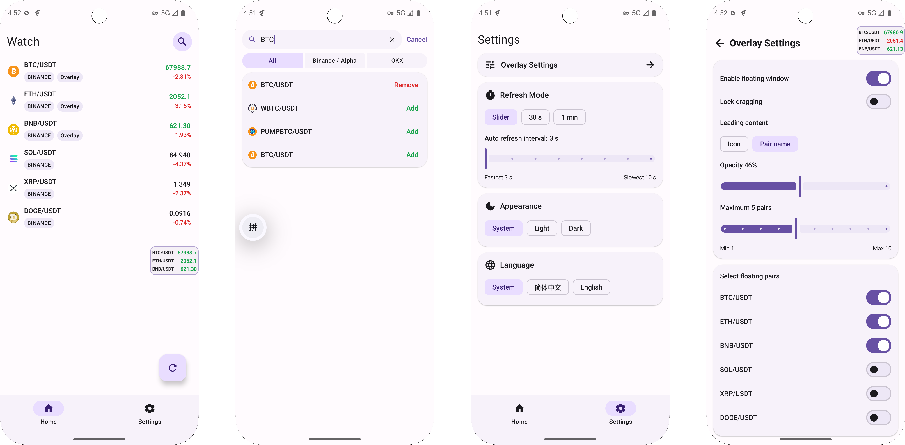

<div align="center">
  
  <h1>CoinMonitor</h1>
  <p>A lightweight Android crypto price monitor built around a watchlist and system overlay workflow.</p>
</div>

<p align="center">
  <a href="./README.zh-CN.md">简体中文</a>
  ·
  <a href="./TECHNICAL.md">Technical Notes</a>
  ·
  <a href="./LICENSE">Apache-2.0</a>
</p>

`CoinMonitor` is an Android app focused on one simple path: search pairs, add them to a watchlist, and optionally pin selected pairs into a floating overlay for quick monitoring across apps.

It supports spot pair search from `Binance Alpha`, `Binance`, and `OKX`. Once a pair is added, you can track it inside the app or send it to the overlay, where a foreground service keeps prices refreshed in the background.

This project is currently designed and iterated primarily through `vibecoding`, while still being kept in a conventional Android project structure so it stays runnable, readable, and maintainable.

<div align="center">
  
</div>

---

## Highlights

- Search spot pairs from `Binance Alpha`, `Binance`, and `OKX`
- Maintain a watchlist with manual refresh and long-press quick actions
- Add or remove items from the floating overlay directly from the home screen
- Configure overlay behavior including drag lock, opacity, max item count, and leading display mode
- Use shared refresh intervals across the home screen and overlay: custom `3-10s`, `30s`, or `1 min`
- Keep the overlay alive with a foreground service and restore it only when runtime conditions are still valid

## Requirements

- Android Studio Koala or newer
- JDK 17
- Android `minSdk 26`
- Android `targetSdk 35`

## Quick Start

```bash
git clone https://github.com/baiyanwu/CoinMonitor.git
cd CoinMonitor
./gradlew :app:assembleDebug
./gradlew testDebugUnitTest :app:lintDebug
./gradlew :app:installDebug
```

## Documentation

- Technical implementation: [TECHNICAL.md](./TECHNICAL.md)
- Chinese README: [README.zh-CN.md](./README.zh-CN.md)
- Contributing guide: [CONTRIBUTING.md](./CONTRIBUTING.md)

## Roadmap

- On-chain pair support
- K-line style views
- AI-assisted analysis
- More watchlist and overlay polish

## Disclaimer

- This project is for technical exploration and personal learning only and does not constitute investment advice.
- `Binance`, `OKX`, and other platform names or APIs belong to their respective owners.
- The app does not provide trading execution. It only displays reference prices, and crypto assets are highly volatile.

## License

This project is licensed under [Apache-2.0](https://www.apache.org/licenses/LICENSE-2.0). See [LICENSE](./LICENSE) for details.
