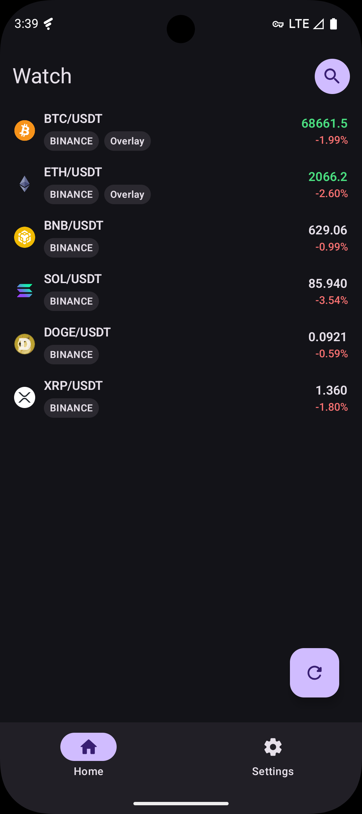
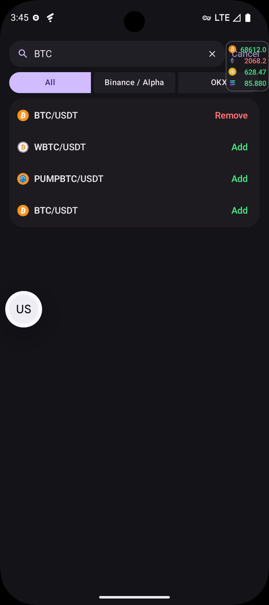
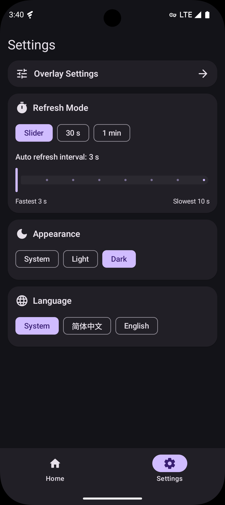
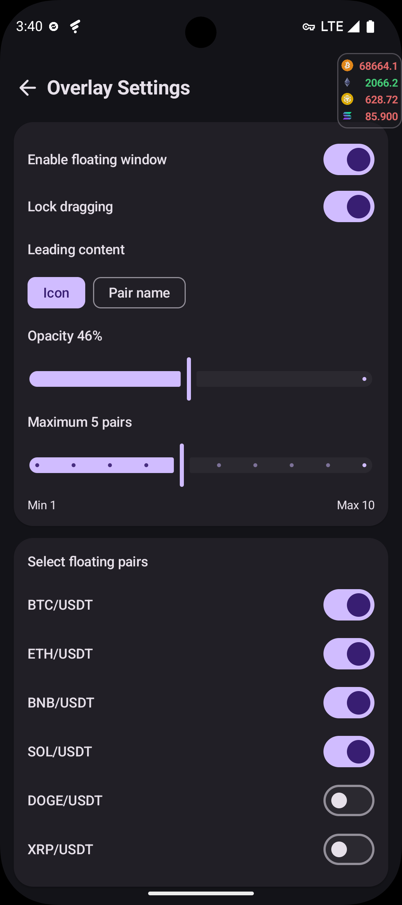

<div align="center">
  
  <h1>CoinMonitor</h1>
  <p>一个专注于观察列表与悬浮窗盯盘体验的 Android 币价监控应用。</p>
</div>

`CoinMonitor` 是一个基于 Android 的轻量级盯盘应用，聚焦“观察列表 + 悬浮窗盯盘”这条核心路径。

它支持从 `Binance Alpha`、`Binance`、`OKX` 搜索现货交易对，加入观察列表后可以在应用内查看，也可以选择加入系统悬浮窗，配合前台服务持续刷新价格。

项目当前主要通过 `vibecoding` 的方式完成设计、实现和迭代，在保证可运行与可维护的前提下快速推进功能落地。

<div align="center">
  
</div>

## 功能

- 支持 `Binance Alpha`、`Binance`、`OKX` 三个数据来源
- 支持观察列表、手动刷新、长按加入悬浮窗
- 悬浮窗支持启用、锁定拖动、透明度、最大展示数量、图标/币对名切换
- 全局刷新间隔支持自定义 `3-10 秒`、`30 秒`、`1 分钟`
- 悬浮窗通过前台服务维持运行，并在符合条件时尝试自恢复


## Screenshots

<div align="center">
  
</div>

### 首页

<div align="center">
  
</div>

### 搜索

<div align="center">
  
</div>

### 设置

<div align="center">
  
</div>

### 悬浮设置

<div align="center">
  
</div>


## Requirements

- Android Studio Koala 及以上版本
- JDK 17
- Android `minSdk 26`
- Android `targetSdk 35`

## Technical Details

技术栈、工程结构和实现说明已经单独整理到 [TECHNICAL.md](./TECHNICAL.md)。

## Quick Start

### 1. Clone

```bash
git clone <your-repo-url>
cd CoinMonitor
```

### 2. Build Debug APK

```bash
./gradlew :app:assembleDebug
```

### 3. Run Tests

```bash
./gradlew testDebugUnitTest :app:lintDebug
```

### 4. Install on Device

```bash
./gradlew :app:installDebug
```

## Roadmap

- 链上币对
- k 线样式
- AI 分析

## Contributing

欢迎提交 Issue 和 Pull Request。

在发起 PR 前，请至少确认：

```bash
./gradlew testDebugUnitTest :app:assembleDebug :app:lintDebug
```

更多说明请查看 [CONTRIBUTING.md](./CONTRIBUTING.md)。

## Disclaimer

- 本项目仅用于技术交流与个人学习，不构成任何投资建议
- `Binance`、`OKX` 等名称和接口归各自平台所有
- 加密资产价格波动较大，请谨慎使用

## License

本项目采用 [Apache-2.0](https://www.apache.org/licenses/LICENSE-2.0) 许可证，详情见 [LICENSE](./LICENSE)。
