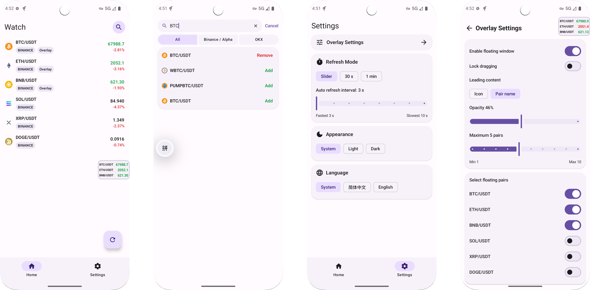

<div align="center">
  
  <h1>CoinMonitor</h1>
  <p>A lightweight Android crypto price monitor built around a watchlist and system overlay workflow.</p>
</div>

<p align="center">
  <a href="./README.zh-CN.md">简体中文</a>
  ·
  <a href="./docs/TECHNICAL.md">Technical Notes</a>
  ·
  <a href="./LICENSE">Apache-2.0</a>
</p>

`CoinMonitor` is an Android app focused on one simple path: search assets, add them to a watchlist, and optionally pin selected items into a floating overlay for quick monitoring across apps. The project is built and iterated primarily through vibecoding.

<div align="center">
  
</div>

---

## Core Features

- Search `Binance Alpha`, Binance spot and USDT-M futures, plus OKX spot and USDT swaps in parallel, then merge, sort, and display one result set after all sources finish
- Search on-chain tokens by name, symbol, or contract address without selecting a chain; every network returned by `DexScreener` is accepted without a local allowlist
- Use the persistent `Show on-chain market cap` switch at the top of Settings to change every on-chain row across Home, the arranged overlay, and the marquee overlay between price and market cap; exchange quotes are unaffected
- Split the home watchlist into swipeable `Exchange / On-chain` pages with category-local ordering, compact quote rows, quick actions, live refresh, and search that opens in the active market mode
- Open the corresponding external market page from a pair title; on-chain rows show `target / counter token` from the selected pool, provide a compact contract address with one-tap full-address copy, and keep the label synchronized when the pool or quote source changes
- Pin selected items into either an arranged floating panel or a full-width, single-line marquee that scrolls tightly packed coin icons and latest prices, with a subtle dot between complete cycles
- Choose the overlay type from a fixed-header settings flow; a dedicated Floating Pairs page handles selection and drag ordering across exchange and on-chain pairs, while arranged and marquee appearances keep independent opacity, font size, item count, position, and motion settings
- Keep the arranged overlay's drag, adaptive layout, and edge docking behavior; it can stay as a docked price panel or collapse into a slim edge tab, with foreground-service persistence for both overlay types
- Review the current build version, project purpose, author, source repository, Apache-2.0 license, feedback link, and usage notice from the in-app About page
- Check GitHub's latest published Release once whenever the main screen is created, then prompt users to open the Release page when a newer version is available; no third-party update service is involved
- Keep exchange quotes flowing through `WSS` first, while DexScreener prices use an independent smart or fixed refresh cycle with sequential request pacing
- Open the middle `Wallet` tab to watch any EVM or Solana address in a dedicated read-only workspace, using the OKX Wallet API for non-zero token balances and USD valuation; credentials stay in Android encrypted storage

## On-chain Notes

- On-chain search, latest price, 24h change, liquidity and volume come from `DexScreener`; candlesticks come from `GeckoTerminal`.
- Results are deduplicated by network and token contract. Each token row shows the selected pair, chain logo, DEX, liquidity, and shortened contract address.
- When multiple valid pools exist, users can expand the row and switch among the most liquid alternatives. The selected pool is then reused for both quote refreshes and candlesticks.
- Home rows retain the selected pool's real pair label. Existing watch items missing the counter token are filled automatically after the next valid quote refresh and do not need to be re-added.
- Market cap comes from the selected DexScreener pool and is accepted only when the tracked token is on the pool's base side. FDV is not used as a fallback, and missing data is rendered as `--`.
- In market-cap mode, brief red/green flashes still follow real price movement. Repeated refreshes at the same price do not flash, and the value returns to its neutral color afterward.
- Icons prefer the DexScreener token image, then fall back through known and online chain-icon candidates to the app's built-in placeholder; a cached chain fallback never bypasses a higher-priority token image request.
- Both on-chain sources are public and require no API key. The app does not provide swap, order, or execution capabilities.

## Requirements

- Android Studio Koala or newer
- JDK 17
- Android `minSdk 26`
- Android `targetSdk 35`

## Quick Start

```bash
git clone https://github.com/baiyanwu/CoinMonitor.git
cd CoinMonitor
./gradlew :app:assembleDebug
./gradlew testDebugUnitTest :app:lintDebug
./gradlew :app:installDebug
```

## Documentation

- Chinese README: [README.zh-CN.md](./README.zh-CN.md)
- Technical implementation: [TECHNICAL.md](./docs/TECHNICAL.md)
- Wallet watch implementation: [WALLET_WATCH.md](./docs/WALLET_WATCH.md)
- Contributing guide: [CONTRIBUTING.md](./docs/CONTRIBUTING.md)

## Disclaimer

- This project is for technical exploration and personal learning only and does not constitute investment advice.
- `Binance`, `OKX`, and other platform names or APIs belong to their respective owners.
- The app does not provide trading execution. It only displays reference prices, and crypto assets are highly volatile.

## License

This project is licensed under [Apache-2.0](https://www.apache.org/licenses/LICENSE-2.0). See [LICENSE](./LICENSE) for details.
