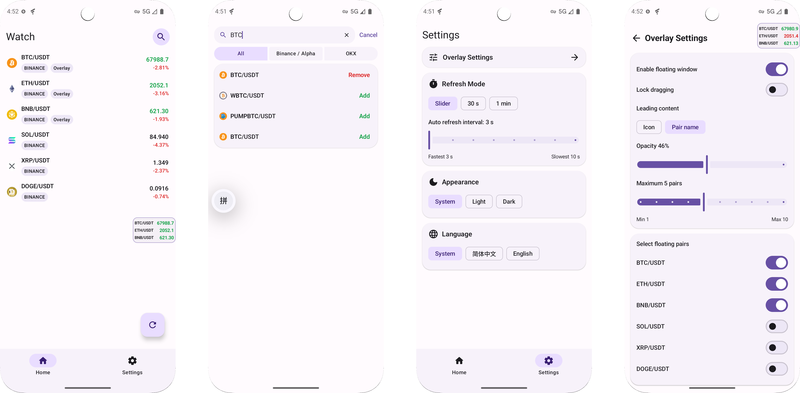

<div align="center">
  
  <h1>CoinMonitor</h1>
  <p>一个专注于观察列表与悬浮窗盯盘体验的 Android 币价监控应用。</p>
</div>

<p align="center">
  <a href="./README.md">English</a>
  ·
  <a href="./docs/TECHNICAL.md">Technical Notes</a>
  ·
  <a href="./LICENSE">Apache-2.0</a>
</p>

`CoinMonitor` 是一个基于 Android 的轻量级盯盘应用，聚焦”观察列表 + 悬浮窗盯盘”这条核心路径，主要通过 vibecoding 的方式迭代推进。

<div align="center">
  
</div>

---

## 核心功能

- 交易所搜索并行覆盖 `Binance Alpha`、`Binance` 现货与 USDT 合约、`OKX` 现货与 USDT 合约，等待全部来源结束后统一合并、排序并一次性展示
- 链上搜索无需选链：输入币名、Symbol 或合约地址后，接受 `DexScreener` 返回的全部网络，不再使用本地链白名单过滤
- 设置页顶部提供持久化的“显示链上市值”通用开关，可让首页、排列型悬浮窗和跑马灯悬浮窗中的全部链上币统一在价格与市值之间切换；交易所行情不受影响
- 首页观察列表拆分为可点击、可左右滑动的“交易所 / 链上”分页；分页内独立排序，采用更紧凑的行情行，并让搜索默认进入当前市场模式
- 首页币对名称可直接打开对应外部行情页；链上币会按当前选中池显示 `目标币 / 另一侧币种`，并提供合约地址缩写与一键复制完整 CA，切池或后续报价刷新时同步更新
- 系统悬浮窗支持“排列型 / 跑马灯型”两种样式：排列型延续原有多行面板，跑马灯型使用无描边的全屏宽单行细条，紧凑滚动币种图标与最新价，并以小圆点标记每轮结束
- 悬浮窗设置页可切换类型；独立的“悬浮币对”页面负责选择与跨交易所/链上拖动排序，两种样式分别保存透明度、字体、展示数量、位置与专属行为
- 排列型继续支持拖动、自适应布局与左右吸附，可保留靠边价格面板或彻底收成屏幕边缘唤出条；两种样式都由前台服务维持，并可从通知栏隐藏或恢复
- 设置中的“关于”页集中展示当前构建版本、项目用途、作者、源码仓库、Apache-2.0 许可、问题反馈入口与使用说明
- 每次主界面创建时通过 GitHub 官方接口检查一次最新已发布 Release；发现更高版本后提示用户打开 Release 页面，不接入第三方更新服务
- 交易所行情优先使用 `WSS`，链上价格使用独立的智能或固定轮转周期，并顺序分散 DexScreener 请求
- 底部导航中间的“钱包”升级为本地自托管钱包，支持动态管理的 EVM 网络与 Solana，可进行多钱包创建/导入、收款、转账、原生币/ERC20/SPL 资产和活动记录，并使用加密存储与可选生物识别保护本机密钥
- 首次默认启用 Ethereum、BNB Chain、Robinhood Chain 和 Solana；目录中的其他 EVM 网络或用户自行验证的标准 EVM RPC 可继续启用，不需要改变钱包模型
- 原 OKX 观察地址从钱包页右上角菜单进入；其地址、筛选、缓存和凭证继续独立保存，不与自托管钱包资产合并

## 链上说明

- 链上搜索与报价按用户设置的 `DexScreener / OKX DEX` 优先级请求；首选来源无结果、失败或未配置时自动尝试下一个。K 线继续由 `GeckoTerminal` 提供，当前不为仅由 OKX 找到的标的提供 K 线。
- 链上结果按“链 + 代币合约”去重，每个代币只展示一条结果；结果会明确显示当前交易对、链 Logo、DEX、流动性和合约缩写。
- 同一代币存在多个有效池时，可以在结果内展开并切换高流动性备选池；所选池会同时用于后续价格刷新与 K 线。
- 首页沿用所选池的真实交易对；历史观察项缺少另一侧币种时，会在下一次有效报价刷新后自动补齐，无需删除重加。
- 市值使用所选 DexScreener 池返回的目标代币市值；仅在目标币位于池子的 base 侧时采用该值，不以 FDV 代替，缺少数据时显示 `--`。
- 切换到市值后仍按真实价格方向触发短暂红绿闪烁；价格未变化的重复刷新不会闪烁，闪烁结束后恢复中性色。
- 图标优先使用 DexScreener 代币图片，再按“已知链图标 → 在线链图标候选 → 应用内置默认占位图”依次回退；已缓存的链图标不会跳过更高优先级的代币图片请求。
- DexScreener 与 GeckoTerminal 无需 API Key；OKX DEX 为可选来源，只使用用户填写并保存在 Android 加密存储中的凭证，项目不内置开发者凭证。应用不提供交易、下单或路由执行能力。

## Requirements

- Android Studio Koala 及以上版本
- JDK 17
- Android `minSdk 26`
- Android `targetSdk 35`

## Quick Start

Wallet Core 的 Android 包通过 GitHub Packages 发布。请创建仅带 `read:packages` 的 classic personal access token，并在不提交版本库的 `local.properties` 中加入：

```properties
gpr.user=你的_GitHub_用户名
gpr.key=你的_只读_PACKAGES_TOKEN
```

```bash
git clone https://github.com/baiyanwu/CoinMonitor.git
cd CoinMonitor
./gradlew :app:assembleDebug
./gradlew testDebugUnitTest :app:lintDebug
./gradlew :app:installDebug
```

## 文档

- 技术实现说明：[TECHNICAL.md](./docs/TECHNICAL.md)
- 观察地址说明：[WALLET_WATCH.md](./docs/WALLET_WATCH.md)
- 自托管钱包说明：[SELF_CUSTODY_WALLET.md](./docs/SELF_CUSTODY_WALLET.md)
- 第三方组件声明：[THIRD_PARTY_NOTICES.md](./docs/THIRD_PARTY_NOTICES.md)
- 英文 README：[README.md](./README.md)
- 贡献说明：[CONTRIBUTING.md](./docs/CONTRIBUTING.md)

## Disclaimer

- 本项目仅用于技术交流与个人学习，不构成任何投资建议
- `Binance`、`OKX` 等名称和接口归各自平台所有
- 钱包支持签名并广播直接转账，但不提供 Swap、订单、跨链桥、质押或投资建议；资产价格仅为估算值

## License

本项目采用 [Apache-2.0](https://www.apache.org/licenses/LICENSE-2.0) 许可证，详情见 [LICENSE](./LICENSE)。
